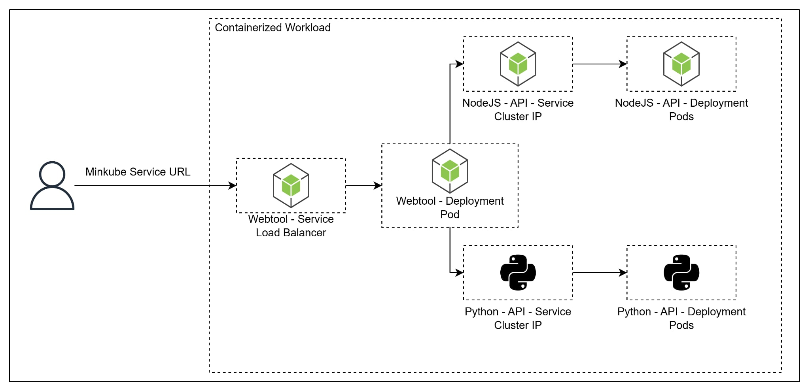

# Containerized Microservices using Docker and Kubernetes



This project demonstrates a containerized miscroservices application deployed on Kubernetes using Minikube. It showcases how different services and deployments interact within a Kubernetes cluster to provide a scalable and modular architecture.

## Key Components
- Frontend (Webtool) - A NodeJS Web application exposed to users via a **LoadBalancer** service.

- Backend APIs - NodeJS API and Python API Exposed internally via a **ClusterIP** service. 

## Setup

### Prerequisites
- Ubuntu
- Minikube
- Kubernetes 

### 1. Cloning the Repository
```bash
git clone git@gitlab.stratpoint.cloud:cloud-bootcamp/batch-2025/interns-batch-2/corpuz-juan/corpuz-milestone-project-2.git
cd corpuz-milestone-project-2
```

### 2. Build the images and push to Docker Hub
Build the image and tag with according to the name you want. After that, push all images to the docker hub of your own. This will be very important that will be needed in pulling images at the manifest files for Kubernetes.

### 3. Creating the API NodeJS Deployment and API NodeJS Service
```bash
cd k8s
kubectl apply -f api-nodejs-deployment.yaml
cd ../services
kubectl apply -f api-nodejs-service.yaml
```

### 4. Creating the API Python Deployment and API Python Service
```bash
cd ../k8s
kubectl apply -f api-python-deployment.yaml
cd ../services
kubectl apply -f api-python-service.yaml
```

### 5 Creating the Webtool NodeJS Deployment and Webtool NodeJS Service
```bash
cd ../k8s
kubectl apply -f web-nodejs-deployment.yaml
cd ../services
kubectl apply -f web-nodejs-service.yaml
```

### 7. List of the Deployments, Services, and Pods
```ubuntu
kubectl get deployment
kubectl get pod
kubectl service
```

### 8. Exposing the Service Outside the Cluster
```ubuntu
minikube service web-nodejs-service
```

### 9. Testing the Project
Open the URL provided by the minikube service at your local browser. 

### 9. Example Result


